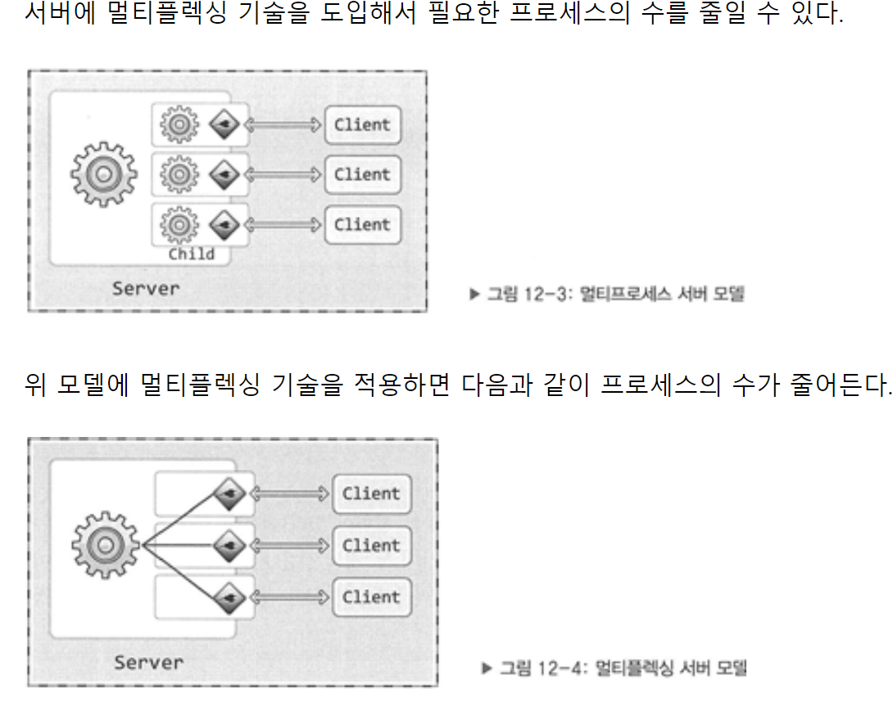

[TOC]

# Part02.HTTP 아키텍처

## Chapter.5 웹 서버

### 서론: 5장의 목표

* 여러 종류의 소프트웨어 및 하드웨어 웹 서버에 대해 조사한다.
  * 다채로운 웹 서버
* HTTP 통신을 진단해주는 간단한 웹 서버를 펄(Perl)로 작성해본다.
  * 간단한 펄 웹서버
  * 진짜 웹 서버가 하는 일
* 어떻게 웹 서버가 HTTP 트랜잭션을 처리하는지 단계별로 설명한다
  * 1단계: 클라이언트 커넥션 수락
  * 2단계: 요청 메시지 수신
  * 3단계: 요청 처리
  * 4단계: 리소스의 매핑과 접근
  * 5단계: 응답 만들기
  * 6단계: 응답 보내기
  * 7단계: 로깅

### 5.1 다채로운 웹 서버

---

* 웹 서버?
  * 소프트웨어와 웹페이지 제공에 특화된 장비(e.g. 컴퓨터) 양쪽 모두를 포함
  * 기능, 형태, 크기가 다양하지만 공통적으로 **리소스에 대한 HTTP 요청을 받아서 콘텐츠를 클라이언트에게 돌려준다**
  * 보통 하드웨어 웹서버를 IaaS(Infra as a Service) 소프트웨어 웹서버를 PaaS(Platform as a Service)라고 함 ?

#### 5.1.1 웹 서버 구현

* 웹 서버는 HTTP 및 그와 관련된 TCP 처리를 구현한 것
  * TCP 커넥션 관리에 대한 책임은 운영체제와 나눠 가짐
* 운영체제는 컴퓨터 시스템의 하드웨어를 관리
  * TCP/IP 네트워크 지원
  * 웹 리소스 유지를 위한 파일 시스템
  * 현재 활동을 제어하기 위한 프로세스 관리
* 웹 서버의 종류
  * 다목적 소프트웨어 웹 서버를 표준 컴퓨터 시스템에 설치 및 실행
  * 전자기기 안에 몇 개의 컴퓨터 칩만으로 구현된 웹서버를 내장시켜 전자 기기를 관리하는 콘솔로 제공

#### 5.1.2 다목적 소프트웨어 웹 서버

* 주요 웹 서버 소프트웨어 by 넷크래프트 2014
  * 마이크로소프트 웹 서버
  * 아파치 웹 서버
    * 전통적 강자
  * nginx 서버
    * 신흥 강자
    * 개발의 모든 목적이 높은 성능에 맞춰진 웹서버
  * 아파치와 nginx 모두 오픈소스 소프트웨어
* 거의 모든 컴퓨터와 운영체제에서 동작 가능함
* 장고는 안전한 웹 서버가 아닌 프레임워크이다.
  * 보안 문제를 통과하지 못함
  * WAS, 웹 어플리케이션 서버는, 웹 서버와 웹 프레임워크를 중계함
  * 보통 웹서버는 정적 / WAS는 동적 데이터를 처리하여 두 가지를 함께 사용한다고 함
    * 단, WAS 만으로 정적/ 동적 리소스를 처리할 수 있지만 웹서버가 앞단에 있는 것이 구조가 단순하며 효율적이라고 함

#### 5.1.3 임베디드 웹 서버

* 일반 소비자용 제품에 내장될 목적으로 만들어진 작은 웹 서버
  * 프린터나 가전제품


### 5.2 간단한 펄 웹 서버

---

* HTTP/1.1의 기능을 지원하려면, 풍부한 리소스 지원, 가상 호스팅, 접근 제어, 로깅, 설정, 모니터링, 그 외 성능을 위해 기능이 필요함
* `type-o-serve`
* `Perl(펄)`로 만든 간단한 웹서버
  * 클라이언트로부터 받은 요청 메시지를 화면에 출력하며 이에 응답을 사용자가 작성하여 보낼 수 있음

```c
#!/usr/bin/perl

use Socket;
use Carp;
use FileHandle;

# (1) 명령줄에서 덮어쓰지 않는 이상 8080포트를 기본으로 사용함
$port = (@ARGV ? $ARGV[0] : 8080);

# (2) 로컬 TCP 소켓을 생성하고 커넥션을 기다리도록(listen) 설정
$proto = getprotobyname('tcp');
socket(S, PF_INET, SOCK_STREAM, $proto) || die;
setsockopt(S,SOL_SOCKET,SO_REUSEADDR,pack("l",1)) || die;
bind(S,sockaddr_in($port, INADDR_ANY)) || die;
listen(S, SOMAXCONN) || die;

# (3) 시작 메시지를 출력한다.
printf("	<<<Type-O-serve Accepting on Port %d>>>\n\n",$port);

while (1)
{
	# (4) 커넥션 C를 기다린다.
	$cport_caddr = accept(C,s);
	($cport,$caddr) = sockaddr_in($cport_caddr);
	C->autoflush(1);
	
	# (5) 누구로부터의 커넥션인지 출력한다.
	$cname = gethostbyaddr($caddr,AF_INET);
	printf("	<<Request From '%s'>>>\n",$came);
	
	# (6) 빈 줄이 나올 때까지 요청 메시지를 읽어서 화면에 출력한다.
	while ($line = <C>)
	{
		print $line;
		if ($line =~ /^\r/) {last;}
	}
	
	# (7) 응답 메시지를 위한 프롬프트를 만들고, 응답줄을 입력 받는다.
    # "." 하나만으로 되어 있는 줄이 입력되기 전까지,입력된 줄을 클라이언트에게 보낸다.
	printf("	<<Type Reponse Followed by'.'>>>\n");
	
	while ($line = <STDIN>)
	{
		$line =~ s/\r//;
		$line =~ s/\r//;
		if ($line =~ /^\./) {last;}
		print C $line."/r/n";
	}
	close(C);
}
```

* 단계 별 해석

  ```
  % type-o-serve.pl 8080
  : 관리자는 특정 포트로 수신하는 type-o-serve 진단 서버를 시작함
  : 여기서 특정 포트는 8080번 포트가 된다
  ```

  ```
  서버 동작 이후 클라이언트는 브라우저를 통해 웹 서버에 접근 가능
  http://www.joes-hardware.com:8080/foo/bar/blah.txt
  ```

  ```
  브라우저로부터 HTTP 요청 메시지를 받은 후
  '.' 마침표 하나뿐인 줄로 끝나는 간단한 응답 메시지의 작성을 기다림
  ```

  ```
  HTTP 응답 메시지를 전송하고 브라우저는 응답 메시지의 본문을 출력함
  ```

  

* HTTP 요청-응답 메시지 블록

  ```
  GET /foo/bar/blah.txt HTTP/1.1
Accept: */*
  Accept-language: en-us
  Accept-encoding: gzip, deflate
  User-agent: Mozilla/4.0
  Host: www.joes.hardware.com:8080
  Connection: Keep-alive
  ```
  
  ```
  %./type-o-serve.pl 8080
  	<<Type-O-Serve Accepting on Port 8080>>
  	
  	<<Request From 'home-44-027.extranet.inktomi.com'>>
  GET /foo/bar/blah.txt HTTP/1.1
  Accept: */*
  Accept-language: en-us
  Accept-encoding: gzip, deflate
  User-agent: Mozilla/4.0
  Host: www.joes.hardware.com:8080
  Connection: Keep-alive
  
  	<<Type response followed by'.'>>
  HTTP/1.0 200 OK
  Connection: close
  Content-type: text-plain
  
  Hi there!
  ```
  
  ````
  HTTP/1.0 200 OK
  Connection: close
  Content-type: text-plain
  
  Hi there!
  ````
  
  

### 5.3 진짜 웹 서버가 하는 일

---

* 1) 커넥션 맺기
  * 접속을 수용하거나 원하지 않는 클라이언트를 거절
* 2) 요청 대기
  * HTTP 요청 메시지를 네트워크로부터 읽음
* 3) 요청 처리
  * 메시지 해석 후 행동
* 4) 리소스 접근
  * 메시지가 가리킨 대상에 접근
* 5) 응답 생성
  * 올바른 헤더를 포함한 HTTP 응답 메시지 생성
* 6) 응답 보냄
* 7) 트랜잭션 로그
  * 로그파일에 트랜잭션 완료 기록을 남김

### 5.4 단계 1: 클라이언트 커넥션 수락

---

* 열려 있는 지속적 커넥션을 사용하거나 새로운 커넥션을 열기
  * Slow start 고려

#### 5.4.1 새 커넥션 다루기

* TCP 커넥션을 통해 IP 주소를 추출하여 거절하거나 새 커넥션을 커넥션 목록에 추가

#### 5.4.2 클라이언트 호스트 명 식별

* 역방향 DNS(reverse DNS)를 통해 IP 주소를 호스트 명으로 변환
* 호스트 명을 이용해서 구체적인 접근 제어와 로깅을 제어
  * 단, `호스트 명 룩업 방식은 웹 트랜잭션을 느려지게 할 수 있음`
  * 대용량 서버는 호스트 명 분석을 끄거나 특정 콘텐츠에만 한정하여 사용

#### 5.4.3 ident를 통해 클라이언트 사용자 알아내기

* ident 프로토콜은 커넥션을 초기화한 사용자의 이름을 알려줌
  * 웹 서버 로깅에서 유용하며, 
  * 일반 로그 포맷의 두 번째 필드는 각 HTTP 요청의 ident 사용자 이름을 담음
* 인트라넷 등에 사용되며 공공 인터넷에서는 잘 사용하지 않음
  * 클라이언트 PC가 identd 신원확인 프로토콜 데몬 소프트웨어가 없음
  * ident 프로토콜은 HTTP 트랜잭션을 지연시킴
  * 방화벽이 ident 트래픽을 막음
  * ident 프로토콜의 보안 수준이 높지 않음
  * ident 프로토콜은 가상 IP 주소를 잘 지원하지 않음
  * 클라이언트 사용자 이름이 노출되어 프라이버시 침해 우려가 있음


### 5.5 단계 2: 요청 메시지 수신

---

* 커넥션에 데이터가 도착하면 웹 서버는 데이터를 파싱하여 요청 메시지를 구성
  * 요청줄 파싱
    * 요청 메서드, 지정된 리소스 식별자(URI), 버전 번호 , CRLF 문자열
  * 메시지 헤더
    * 각 메시지 헤더의 CRLF
    * 헤더의 끝을 의미하는 CRLF로 끝나는 빈 줄
  * 본문


#### 5.5.1 메시지의 내부 표현

* 요청 메시지를 내부 자료 구조에 저장


#### 5.5.2 커넥션 입력/출력 처리 아키텍처

* 웹 서버는 수천개의 커넥션을 동시에 열 수 있음
  * 웹 서버는 항상 새 요청을 주시함


* 단일 스레드 웹서버
  * 한 번에 하나씩 요청을 처리
  * 성능 문제가 심각하기 때문에 진단도구, 로드가 적은 서버에서 사용함
* 멀티프로세스와 멀티스레드 웹 서버
  * 여러 요청을 동시에 처리하기 위해 여러 개의 프로세스 혹은 고효율 스레드 할당
    * 프로세스란 어떤 프로그램의 자신만의 변수 집합을 갖는 하나의 독립된 제어 흐름
    * 하나의 프로그램이 여러 작업을 하게 만드는 역할
    * 스레드는 프로세스의 더 빠르고 효율적인 버전
  * 스레드/프로세스의 최대 개수를 제한하여 메모리와 시스템 리소스 낭비를 예방
* 다중 I/O 서버
  * 모든 커넥션은 동시에 그 활동을 감시당함
  * 커넥션에 실제로 할 일이 있을 때만 작업을 수행함
    * 유휴 상태의 커넥션을 기다리는 리소스 낭비가 없음
  * Multiplexing
    * 멀티플렉서, mux는 하나의 채널에 여러 개의 신호를 실어보내는 장비
    * 하나의 회선 또는 전송로를 분할하여 다수의 개별적으로 독립된 신호를 동시에 송수신함
    * 전송 채널은 일반적으로 n배의 넓은 대역폭을 가짐
* 다중 멀티스레드 웹서버
  * CPU 여러 개의 이점을 살리기 위해 멀티스레딩과 다중화를 결합



### 5.6 단계 3: 요청 처리

---

* 메서드, 리소스, 헤더, 본문을 통해 요청을 처리

### 5.7 단계 4: 리소스의 매핑과 접근

---

* 웹서버는 곧 리소스 서버
  * 정적 컨텐츠, 동적 컨텐츠를 제공

#### 5.7.1 Docroot

* 요청 URI를 웹 서버의 파일 시스템 안에 있는 파일 이름으로 사용하여 리소스 매핑
* 웹 컨텐츠를 위해 예약해 둔 폴더를 '문서루트','docroot'라고 함
  * 경로: 문서루트 + 요청 메시지 URI

* 허락 되지 않은 파일을 보호하기 위해 docroot 이외 부분에 대한 접근을 방지해야 함
* 가상 호스팅
  * 한 웹 서버에서 여러 개의 웹사이트를 호스팅
  * 각 서버 별로 분리된 문서 루트를 할당하여 기능을 구현함
  * IP 주소 혹은 호스트 명을 통해 문서 루트 식별이 가능함


* 사용자 홈 디렉터리 docroots
  * 한 대의 웹서버에서 각자 개인의 웹 사이트를 만들 수 있음
  * 빗금(/) 혹은 물결(~)의 URI는 사용자 개인의 문서 루트를 가리킴


#### 5.7.2 디렉터리 목록

* 파일 뿐만 아니라 디렉터리 URL 요청도 받을 수 있음
* 서버의 선택
  * 에러 반환
  * '색인 파일' 반환
    * 대부분 웹서버의 index.html 파일의 콘텐츠를 갖고 있으며 이를 반환
  * 디렉터리의 내용을 담은 HTML 페이지 반환
    * 색인 파일이 없고, 디렉터리 색인 기능이 켜져 있으면
    * 파일의 크기/변경일/링크를 열거한 HTML 파일을 반환함 (보안문제)


#### 5.7.3 동적 콘텐츠 리소스 매핑

* 어플리케이션 서버는 백엔드 어플리케이션과 웹서버를 연결하여 동적 콘텐츠 생성 프로그램의 경로를 제공하며 이를 실행할 수 있는 인터페이스를 제공함
* URI의 경로명이 실행 가능한 프로그램이 위치한 디렉터리로 매핑 되도록 설정
  * 서버는 경로에 대응하는 디렉터리에서 프로그램을 찾아 실행을 시도


#### 5.7.4 서버사이드 인클루드(Server-Side Includes, SSI)

* 서버사이드 인클루드를 포함한 리소스는 클라리언트에게 보내기 전에 처리됨
  * 콘텐츠에 변수 이름이나 
  * 내장된 스크립트가 될 수 있는 어떤 특별한 패턴이 있는지 검사 받음
* 서버사이드란
  * 서버 쪽에서 행해지는 처리를 말함
  * 클라이언트가 PHP 등 서버사이드 스크립트 언어를 포함하고 있으면 서버는 이 부분을 처리하여 결과를 보냄
  * include 지시자를 사용하면 서버사이드 인클루드이며
  * 다른 파일을 이 파일 내부로 불러들이는 역할
  * SSI란 쉽게 말하면 한 번에 여러 파일을 보는 기능

#### 5.7.5 접근 제어

* 클라이언트 IP 주소에 근거하여 리소스에 접근을 제어하고 비밀번호를 물어봄

### 5.8 단계 5: 응답 만들기

---

* 리소스 식별 후 요청 메서드의 동작을 수행한 뒤 응답 메시지 반환

#### 5.8.1 응답 엔터티

* 응답 본문 생성 시 메시지에 작성
  * 본문의 MIME 타입을 서술하는 Content-Type 헤더
  * 본문의 길이를 서술하는 Content-Length 헤더
  * 실제 내용

#### 5.8.2 MIME 유형 결정하기

* MIME 타입과 리소스를 연결
  * mime.types
    * 파일 이름의 확장자를 사용한 연결
  * 매직 타이핑(Magic typing)
    * 파일의 내용을 검사하고 mime 패턴 테이블[매직 파일]에서 검색
    * 느리지만 표준 확장자 없이 이름 지어진 경우에 편리함
  * 유형 명시(Explicit typing)
    * 파일 확장자와 내용에 상관없이 어떤 MIME 타입을 갖도록 웹서버를 세팅
  * 유형 협상(Type negotiation)
    * 하나의 리소스가 여러 종류의 형식에 속하도록 설정
    * 서버- 클라이언트의 협상에서 가장 좋은 형식을 제공할 수도 있음


#### 5.8.3 리다이렉션

* 서버가 요청을 수행하기 위해 성공 메시지 대신 리다이렉션 기능을 사용함
* 리다이렉션이 유용한 경우
  * 리소스가 영구히 이동된 경우
    * 301 Moved Permanently
    * 클라이언트에게 리소스의 이름이 바뀌었으므로 북마크를 갱신하라고 알려줌
  * 리소스가 임시로 옮겨진 경우
    * 303 See Other / 307 Temporary Redirect
    * 새 위치로 리다이렉트 하지만 임시적이기 때문에 북마크 갱신을 원치 않음
  * URL 증강
    * 303 See Other / 307 Temporary Redirect
    * 문맥 정보를 포함시켜서 상태 정보를 내포한 새 URL을 클라이언트에게 발송
    * 클라이언트는 이 경로를 따라가 완전한 URL을 요청
    * 트랜잭션 간 상태를 유지하는 유용한 방법
    * Amazon.com에서 사용자에게 식별번호를 할당해 추적하는 예입니다. `20658007011` 라는 특정 값이 URL에 계속 붙어 사용자를 추적하는것을 확인 할수 있습니다.
  * 부하 균형
    * 303 See Other / 307 Temporary Redirect
    * 서버 과부하시 부하의 여유가 있는 서버로 리다이렉트
  * 친밀한 다른 서버가 있을 때
    * 303 See Other / 307 Temporary Redirect
    * 사용자에 대한 정보를 가지고 있으면 그 정보를 갖고 있는 다른 서버로 리다이렉트 할 수 있음
  * 다이렉트 이름 정규화
    * URI요청에 빗금(/)을 빠뜨리는 경우
    * 대부분 웹 서버는 상대경로가 정상적으로 동작하도록 슬래시를 추가해서 리다이렉트 기능을 지원함

### 5.9 단계 6: 응답 보내기

---

* 커넥션의 상태를 추적하여 응답 메시지를 보낼 연결점을 찾음
  * 일부는 아무것도 하지 않는 커넥션
  * 일부는 데이터를 받고 있는 커넥션
  * 일부는 데이터를 보내고 있는 커넥션
* 지속적인 커넥션이라면 특수한 경우에 열린 상태를 유지함
  * 서버가 Content-Length 헤더를 바르게 계산하기 위해 주의가 필요한 지 살피거나
  * 클라이언트가 응답이 언제 끝나는지 알 수 없는 경우를 살펴
* 비지속적 커넥션이라면
  * 전송 후 닫음

### 5.10 단계 7: 로깅

---

* 트랜잭션 완료 시 이에 대한 로그를 로그 파일에 기록함

