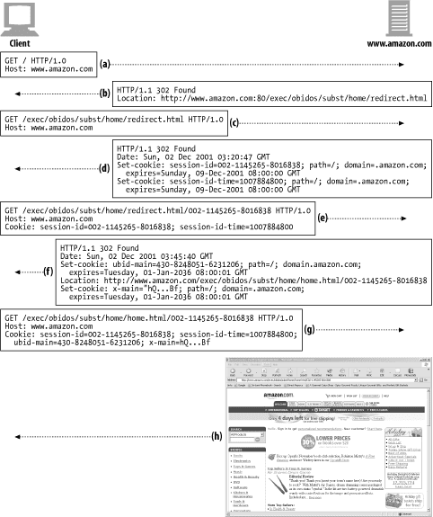

[TOC]

# Part03.식별,인가,보안

## Chapter.11 클라이언트 식별과 쿠키

### 서론: 11장의 목표

* 클라이언트를 추적
  * 서버는 클라이언트의 요청을 처리하는 것 이외에도 
  * 클라이언트를 추적해야 할 수도 있음
* 사용자 식별 기술
  * HTTP헤더
  * IP 주소
  * 로그인 인증
  * Fat URL
  * 쿠키

### 11.1 개별 접촉

---

* HTTP의 특성
  * HTTP는 익명으로 사용
  * `무상태`를 지향(Stateless)
  * `연결 자체에 대한 정보를 갖지 않아` 매 요청이 일회성이고 독립적으로 처리됨

* 클라이언트 식별이 필요한 경우

  * `개별 인사`

    > 사용자에게 특화된 환영 메시지나 페이지 내용

  * `사용자 맞춤 추천`

    > 고객의 흥미를 학습하여 제품과 서비스 추천

  * `저장된 사용자 정보`

    > 거주 주소, 신용카드 정보 등의 복잡한 작업을 대신해줌

  * `세션 추적`

    > HTTP 트랜잭션은 상태가 없음
    >
    > 웹 사이트는 사용자의 상태를 남겨 사용자와 상호작용하려고 함
    >
    > 상태를 유지

### 11.2 HTTP 헤더

---

| 헤더 이름       | 헤더 타입  | 설명                 |
| --------------- | ---------- | -------------------- |
| From            | 요청       | 사용자 이메일 주소   |
| User-Agent      | 요청       | 사용자 브라우저      |
| Referer         | 요청       | 이전 페이지          |
| Authorization   | 요청       | 사용자 이름/비밀번호 |
| Client-ip       | 요청[확장] | 클라이언트 IP주소    |
| X-Forwarded-For | 요청[확장] | 클라이언트 IP주소    |
| Cookie          | 요청[확장] | 서버가 생성한 ID라벨 |

* From
  * `이메일 주소 값`을 헤더에 달아서 보냄
  * 단, `스팸 메일`을 발송 받을 수 있어 권장하지 않음
  * 로봇, 스파이더의 경우 From 헤더에 이메일 주소를 기술하는 경우도 있음
    * 데이터 수집 과정에서 본의 아니게 웹사이트에 문제를 일으킬 수 있으므로
* User-Agent
  * `브라우저 이름 / 버전 정보 / 운영체제 정보`
  * 사용자 식별에 도움이 되지 않음
* Referer
  * `현재 페이지로 유입하게 한 웹페이지의 URL`
  * 사용자의 `취향` 파악 가능

### 11.3 클라이언트 IP 주소 [Client-ip, X-Forwarded-For]

---

* 클라이언트가 기술하지 않아도 웹서버가 클라이언트의 IP 주소를 알아낼 수 있음
  * 인트라넷 같이 제한된 영역에서 유용할 수 있음
* 전제
  * 한 IP 주소는 한 사용자를 가리킨다
  * 사용자는 확실한 IP 주소를 가지고 있다
  * 사용자의 IP 주소는 바뀌지 않는다
  * 서버에게 전달되는 IP 주소는 사용자의 IP 주소다
* 약점(반론)
  * 동일한 컴퓨터를 여러 사용자가 사용하는 경우 IP 주소는 중복되어 1대1 관계가 깨진다
  * 대부분의 ISP(인터넷 서비스 제공업체)는 동적으로 IP 주소를 할당하여 사용자의 IP 주소는 매번 바뀐다
  * 보안을 강화하기 위해 네트워크 주소 변환(Network Address Translation) 방화벽을 통해 실제 IP 주소는 방화벽 뒤로 숨고, 방화벽 IP주소가 전달된다
  * HTTP 프락시와 게이트웨이의 IP 주소가 전달된다
    * 이를 해결하기 위해 Client-ip, X-Forwarded-For 헤더를 확장했으나 모든 프록시가 이를 인식하지 않음

### 11.4 사용자 로그인 [Authorization]

---

* HTTP의 자체적인 체계
  * WWW_Authenticate 헤더
  * Authorization헤더
  * 한 번 로그인하면 브라우저[클라이언트]는 모든 요청에 로그인 정보를 함께 보냄
* 동작 과정
  * 요청
  * 응답: 401 Login Required
  * 요청: Authorization: xxxxxxxxxxx

### 11.5 뚱뚱한 URL

---

* 정의
  * 상태 정보를 포함하여 확장된 URL
* 예시
  * 사용자에게 할당된 식별번호: 002-114
  * 기존 URL: http://s1.amazon.com/
  * Fat URL: http://s1.amazon.com/002-114/
* 기능
  * 독립적인 HTTP 트랜잭션을 하나의 '세션', '방문'으로 묶는 용도로 사용함
* 동작
  * 유저의 방문
  * 서버의 ID 생성 - URL 추가 - 리다이렉트
  * URL 추가 리다이렉트 값 - 사용자 아이디와 관련된 추가적인 정보와 관련된 하이퍼링크는 모두 Fat URL로 경로를 재설정
* 단점[심각한 문제]
  * 못생긴 URL
    * 사용자가 혼란을 느낄 수 있음
  * 공유하지 못하는 URL
    * 만약 URL 주소가 공유되면 개인 정보가 유출되는 격
  * 캐시 할 수 없음
    * URL이 달라지기 때문에 기존 캐시에 접근이 불가능
  * 서버 부하 가중
    * HTML 페이지를 Fat URL에 대해 다시 그려야 함
  * (세션) 이탈
    * 의도치않게 Fat URL 세션 에서 이탈하는 경우가 발생함
    * 모든 세션 상태가 초기화됨
  * 세션 간 지속성 부재
    * 사용자(클라이언트)가 Fat URL을 북마킹하지 않으면 모든 정보가 초기화

### 11.6 쿠키[Cookie; Set-Cookie]

---

* 넷스케이프 최초 개발, 모든 브라우저가 사용
* 캐시와 충돌 가능성이 있어 대부분의 캐시나 브라우저는 쿠키의 내용물을 캐싱하지 않음

#### 11.6.1 쿠키의 타입

* 두 가지
  * 세션 쿠키(session cookie)
  * 지속 쿠키(persistent cookie)
* 세션 쿠키
  * 사이트 탐색할 때 관련한 설정과 선호 사항들을 저장하는 임시 쿠키
  * 브라우저를 닫으면 삭제
* 지속 쿠키
  * 주기적으로 방문하는 사이트에 대한 설정 정보, 로그인 이름을 유지
  * 디스크에 저장되어 브라우저를 닫거나 컴퓨터를 재시작해도 살아있음
* 차이점
  * 파기되는 시점
  * 기본값 or Discard 파라미터 설정: 세션쿠키
  * Expires 혹은 Max-Age 파라미터 설정: 지속 쿠키

#### 11.6.2 쿠키는 어떻게 동작하는가

* 정의

  * 서버가 사용자에게 붙이는 스티커

* 동작

  * 사용자의 방문

  * 웹 서버는 유일한 값을 쿠키에 할당하여 HTTP 응답을 보냄

    > Set-Cookie: 임의의 유일한 이름 = "value"

  * 브라우저는 Set-Cookie 헤더에 있는 쿠키 콘텐츠를  브라우저의 쿠키 데이터베이스에 저장

  * 브라우저는 서버에 방문하여 Cookie 요청 헤더를 보냄

  * 서버는 데이터베이스에서 쿠키 값을 사용하여 사용자의 정보를 찾음

#### 11.6.3 쿠키 상자: 클라이언트 측 상태

* 클라이언트 측 상태의 기본 발상 및 정의
  * 클라이언트가 서버에 대한 정보를 저장한다
  * 서버에 접근하며 해당 정보를 전송한다
  * 공식 명칭 `'HTTP 상태 관리 체계'`
* 구글 크롬
  * Cookies라는 SQLite 파일에 쿠키를 저장

| creation_utc | host_key  | name     | value | path   | expires_utc | secure |
| ------------ | --------- | -------- | ----- | ------ | ----------- | ------ |
| 14234        | naver.com | guest_id | xxx   | /index | 14235       | 0 / 1  |

* 필드의 의미
  * creation_utc: 생성된 시각
  * host_key: 쿠키의 도메인
  * name: 쿠키의 이름
  * value: 쿠키의 값
  * path: 쿠키와 관련된 도메인의 경로
  * expire_utc: 파기 시점
  * secure: SSL 커넥션에 대한 배타성 유무

* 마이크로 소프트 인터넷 익스플로러 쿠키
  * 캐시 디렉터리에서 확인 가능

#### 11.6.4 사이트마다 각기 다른 쿠키들

* 쿠키의 사이트 도메인을 이용하여 해당 사이트에 맞는 쿠키만 보낸다
  * 웹사이트 광고의 경우
    * 광고 당사에서 지속 쿠키를 만들어냄
    * 유저가 서로 다른 웹사이트에서부터 광고 웹사이트를 방문해도 동일한 지속 쿠키를 사용하여 요청 메시지를 전송
    * 광고사가 Refer 헤더를 접목한다면 사용자에 대한 추가 정보를 습득할 수 있음
* 쿠키 Domain 속성
  * 서버가 다른 서버의 쿠키 조회를 제어하는 역할
  * `Set-cookie: user="mary17"; domain="airtravelbargains.com"`
* 쿠키 Path 속성
  * 웹 사이트 내부에서도 일부 경로에만 한정된 쿠키
  * `Set-cookie: pref=compact; domain="airtravelbargains.com"; path=/autos/`
  * 사용자가 단순히 홈페이지를 방문하게 되면
    * `Cookie: user="mary17"`
  * 사용자가 autos(자동차) 홈페이지를 방문하게 되면
    * `Cookie: user="mary17"`
      `Cookie: pref=compact`

#### 11.6.5 쿠키 구성요소

* 쿠키의 구성 요소를 정의한 두 가지 버전
  * Version 0: 넷스케이프 쿠키
  * Version 1: RFC 6265 [본래 RFC 2965를 대체]

* Version 1이 널리 쓰이는 것은 아니라고 함

#### 11.6.6 Version 0(넷스케이프) 쿠키

* 명세사항

**Set-Cookie: name=value [;expires=date] [; path=path] [; domain=domain] [; secure]**

**Cookie: name1=value1 [; name2=value2]**

* Set-Cookie 헤더

  | 속성    | 설명,용례                           |
  | ------- | ----------------------------------- |
  | 이름=값 | 유일한 필수 속성                    |
  | Expires | 생명주기: 반드시  GMT 형식으로 사용 |
  | Domain  | 기본값: 서버 호스트 명              |
  | Path    | 기본값: 서버 응답 URL 경로          |
  | Secure  | 기본값: 0                           |

* Cookie 헤더
  * 사이트 정보를 확인하여 필드 값을 선택하여 요청을 보냄

#### 11.6.7 Version 1(RFC 2965) 쿠키

* 모든 브라우저와 서버에서 통용되는 것은 아님
* 주요 차이점
  * 책 313p 참조
  * 쿠키마다 설명문이 있음
  * 브라우저가 닫히면 쿠키를 강제로 삭제할 수 있음
  * 날짜 값 대신 초 단위의 상대적인 값 필드 Max-Age
  * URL 포트번호로 제어 가능
  * $ 접두어를 사용하여 사용자 이름과 키워드를 구별함
* Set-Cookie2 속성
  * 책 314p 참조
* Cookie 헤더
  * 책 315p 참조
* Cookie2 헤더: 버전 협상
  * 클라이언트와 서버가 다른 쿠키 버전을 사용할 때 호환성을 협상할 수 있음
  * 클라이언트(사용자)가 새로운 형식의 쿠키를 지원한다는 것을 알림
    * `Cookie2: $ Version ="1"`
  * 서버는 Set-Cookie2 헤더를 보내는 것이 표준

#### 11.6.8 쿠키와 세션 추적

* 쿠키는 여러 차례의 트랜잭션을 통해 사용자를 추적하는 데 사용함
  * 클라이언트의 서버 접속
  * 리다이렉트
  * URL 리라이트
  * 쿠키 생성 및 발급

* 아마존 예시

`(d): Set-cookie: session-id=002-...`

`(e): Cookie: session-id = 002...`

`(f): Set-cookie: x-main="h...Bf";`

`(g): Cookie: session-id = 002...; x-main=hQ...Bf`

#### 11.6.9 쿠키와 캐싱

* 쿠키는 개인 정보와 관련되기 때문에 원칙에 따라 캐싱에 주의가 필요함
* 캐시 금지 문서 표시
  * `Cache-Control: no-cache="Set-Cookie"` > 캐시 금지 문서 표시하기
  * `Cache-Control: public` > 캐시 되는 문서에 표시하기
* Set-Cookie 헤더 응답 주의
  * `if Set-Cookie in Response.Header`
    * 본문은 캐시해도 set-cookie 헤더는 캐시하지 않도록 처리
    * 아예 캐시하지 않도록 처리
  * 만약, 캐시가 Set-cookie 헤더를 제거하면 클라이언트가 cookie 정보를 저장하지 못해 소용이 없어짐
    * `Cache-control: must-revalidate, max-age=0`
    * 원서버와 재검사를 통해 위와 같은 문제를 방지할 수 있음
* Cookie 헤더 요청 주의
  * Cookie 요청이 있으면 응답 메시지의 결과 콘텐츠에 개인 정보를 담을 가능성이 있음
    * Cookie 요청 - 응답 메시지의 경우 캐시하지 않도록 처리
  * 문서에 대한 캐시를 피하기 위해
    * 캐시 이미지에 파기 시간이 0인 Cookie 헤더를 설정해서 매번 재검사를 하는 것이 더 효율적 방식

#### 11.6.10 쿠키, 보안 그리고 개인정보

* 쿠키가 보안상 엄청나게 위험한 것은 오해다
  * 비활성화 가능
  * 쿠키 이외의 추적 기능: 로그 분석 등
  * by 미 재무성 컴퓨터사고 자문단(The Computer Incident Advisroy Capability)
* 대표적인 오용 사례
  * 협렵업체 웹사이트의 지속 쿠키를 이용한 사용자 정보 추적
* 쿠키는 개인정보 정책에 유의한다면 세션 조작과 트랜잭션상의 편리함 장점이 큰 기능